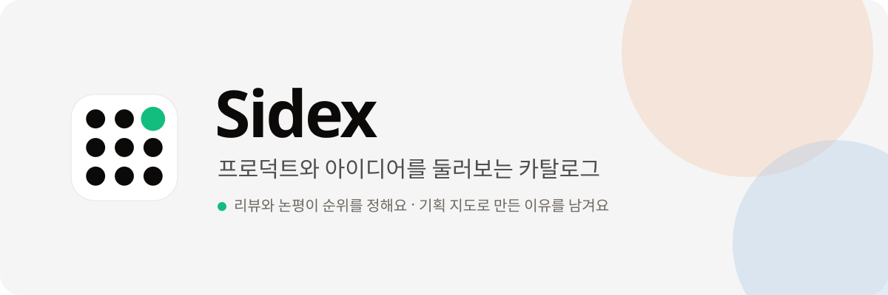
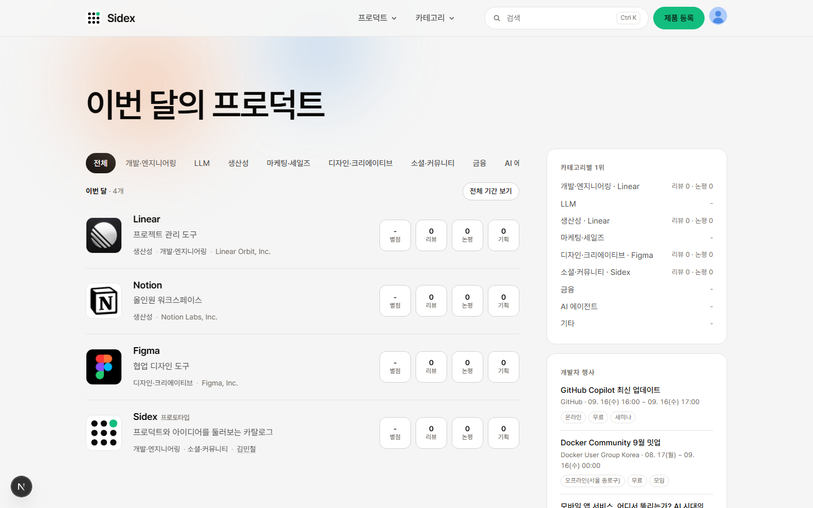
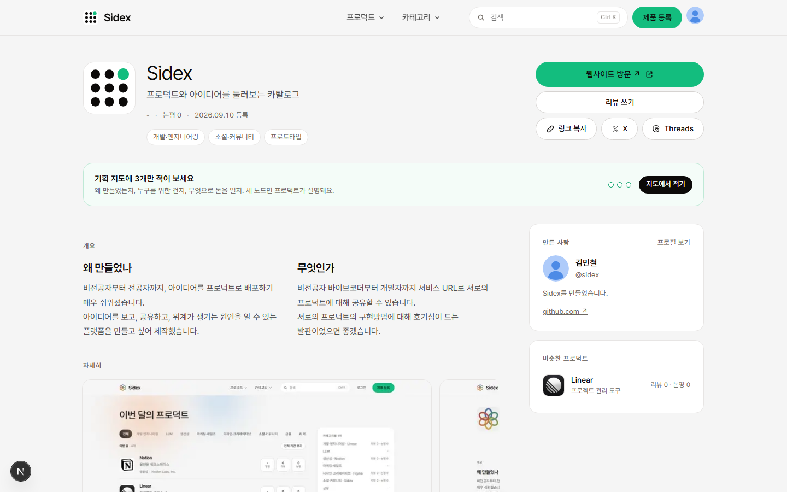
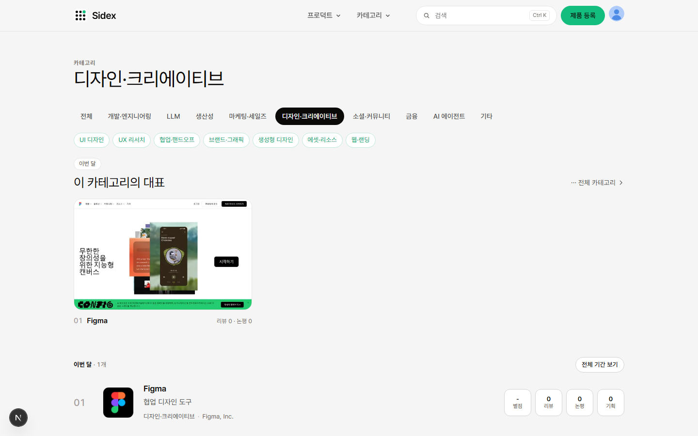
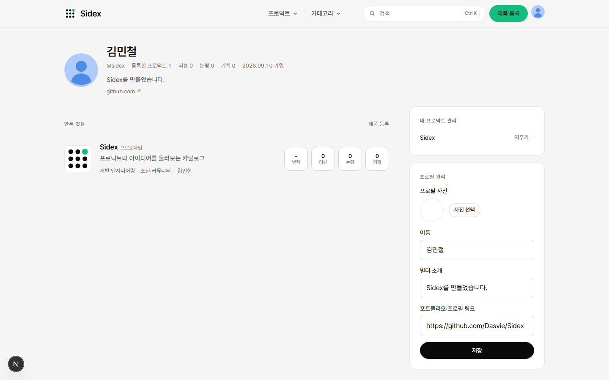

<div align="center">



<br />

**한국 개발자와 바이브코더가 만든 프로덕트를 등록하고, 리뷰와 논평으로 순위가 정해지는 카탈로그.**

[](https://sidex-pi.vercel.app)
[](web)
[](web/src/db/schema.ts)
[](web/tests)
[](web/src/lib/i18n.ts)

<br />

<a href="#-화면"></a>&nbsp;
<a href="#-기획-지도"></a>&nbsp;
<a href="#-로컬에서-실행"></a>&nbsp;
<a href="https://github.com/Dasvie/Sidex/issues"></a>

</div>

<br />

> 배포용 URL 하나로 등록하면 프로덕트 페이지가 생기고 랭킹에 실려요. 순위는 오직 리뷰와 논평이 만들어요.
>
> 지금 바로: **https://sidex-pi.vercel.app**

<hr />

## 무엇인가

Sidex는 만든 사람이 자기 프로덕트를 올리고, 다른 사람이 써 보고 리뷰와 논평을 남기는 곳이에요. 업보트도, 날짜 순위도, 광고도 없어요. **순위 = 리뷰 × 3 + 논평 × 1 + 답글 × 0.5.** 만든 사람의 논평은 세지 않고, 별점은 순위에 들어가지 않아요.

여기까지는 랭킹 사이트예요. Sidex가 다른 점은 **기획**이에요. 프로덕트마다 기획 지도가 열리고, 만든 사람은 "왜 이 문제를, 누구를 위해, 어떤 수익 모델로" 같은 질문에 자기 답을 남겨요. 읽는 사람은 그 판단에 동의하거나 반대해요. 디자인 시스템(DESIGN.md)도 그대로 실려요.

## 이렇게 다릅니다

| | Sidex |
|---|---|
| 순위 | 리뷰·논평·답글만. 만든 사람의 논평 제외, 별점 제외, 업보트 없음 |
| 리뷰 | 별점 + 사용성·완성도·디자인·독창성 4축 + 좋은 점·아쉬운 점 필수. 1인 1건, 만든 사람 불가 |
| 기획 지도 | 8가지 질문(문제·사용자·가치·기능·경험·비즈니스·성장·시스템) × 4단계, 카테고리별 주제 트리. 만든 사람의 기록과 읽는 사람의 동의/반대 |
| 디자인 시스템 | DESIGN.md를 붙이면 색·타이포·버튼·카드·간격·엘리베이션·반응형 시트가 그려져요 |
| 등록 | 주소 하나 → 자동 채움 → 랭킹 행 미리보기 → 필수 3항목이면 등록. 화면은 등록 뒤에 |
| 언어 | 한국어 기본, 영어 지원. 회원이 쓴 글은 번역하지 않아요 |

## 화면

<div align="center">
<table>
<tr>
<td width="50%"><br /><sub>홈 · 이번 달의 프로덕트</sub></td>
<td width="50%"><br /><sub>프로덕트 상세 · 개요, 자세히, 기획 지도, 디자인 시스템, 리뷰</sub></td>
</tr>
<tr>
<td width="50%"><br /><sub>카테고리 · 대표 3개와 주제</sub></td>
<td width="50%"><br /><sub>프로필 · 만든 프로덕트, 최근 기획 기록</sub></td>
</tr>
</table>
</div>

## 기획 지도

프로덕트를 가운데 두고 왼쪽엔 그 카테고리의 주제, 오른쪽엔 서비스 하나를 기획할 때 답해야 하는 여덟 가지 질문이 펼쳐져요. 노드를 누르면 아래 주제로 내려가고, 만든 사람이면 그 노드에 기록을 남길 수 있어요. 콘텐츠는 [`web/src/lib/planmap.ts`](web/src/lib/planmap.ts) 한 파일에 있어요(약 1,600 노드, 한·영).

## 기술 스택

| 영역 | 선택 |
|---|---|
| 앱 | Next.js 16 App Router, React 19, TypeScript |
| 데이터 | Postgres(Neon) + Drizzle. 로컬은 PGlite |
| 인증 | Auth.js v5 · Google · Kakao · Naver |
| 이미지 | Vercel Blob(로컬은 파일 폴백), sharp로 리사이즈 |
| 도우미 | Anthropic API(선택). 키가 없으면 안 떠요 |
| 디자인 | Pretendard 한 벌, 오프화이트 캔버스, 그린 CTA 하나 |
| 테스트 | node:test 단위 15 · Playwright 스모크·메이커 플로우 35 |

## 로컬에서 실행

```bash
cd web
npm install
cp .env.example .env.local   # 값은 비워도 로컬은 돌아가요
npm run db:migrate           # PGlite에 스키마
npm run db:seed              # 예시 프로덕트 4개
npm run dev                  # http://localhost:3000
```

개발 서버에서는 시드 회원 `@sidex`로 상시 로그인돼요(`DEV_USER_HANDLE`, 프로덕션에서는 꺼짐). 업로드는 `public/uploads/`로 떨어져요.

```bash
npm run typecheck && npm test && npm run build   # 끝났다의 기준
npm run e2e                                      # dev 서버를 켜 둔 채로
```

## 배포

Vercel에서 돌아가요. Root Directory `web`, 나머지는 리포에 다 들어 있어요.

1. Vercel에서 이 리포를 Import, Root Directory를 `web`으로.
2. Storage 탭에서 **Neon**(변수 접두사 `DATABASE`)과 **Blob**(read-write 토큰 포함)을 연결. `DATABASE_URL`·`DATABASE_POSTGRES_URL`·`POSTGRES_URL` 어느 이름이든 읽어요.
3. 환경 변수: `AUTH_SECRET`(`npx auth secret`), `AUTH_URL`·`NEXT_PUBLIC_SITE_URL`(배포 주소), 로그인 제공자 키(`AUTH_GOOGLE_*`, `AUTH_KAKAO_*`, `AUTH_NAVER_*` 중 있는 것), `OWNER_EMAIL`(만든 사람 이메일). 전체 목록은 [`web/.env.example`](web/.env.example).
4. 배포. 빌드 때 마이그레이션과 시드가 자동으로 돌아요([`web/vercel.json`](web/vercel.json)). `OWNER_EMAIL` 계정이 처음 로그인하면 예시 계정 @sidex가 그 계정으로 넘어와요.
5. `/api/health`가 빠진 설정을 알려줘요. `ready: true`면 끝.

OAuth 콜백은 `https://<도메인>/api/auth/callback/google`, `/kakao`, `/naver`.

## 원칙

- 가상의 데이터·문구를 서비스에 넣지 않아요. 예시 프로덕트(Notion·Figma·Linear)의 소개는 각 사이트와 Wikipedia에서, 화면은 실제 캡처에서, 디자인 시스템은 `npx getdesign add`로 받은 원문에서 왔어요.
- 키와 비밀번호는 리포 어디에도 없어요. `.env*`는 훅이 막아요.
- 문구는 짧은 해요체. `—`는 쓰지 않아요.

## 기여

이슈와 PR 환영해요. 방법은 [CONTRIBUTING.md](CONTRIBUTING.md), 규칙은 [`CLAUDE.md`](CLAUDE.md)에 있어요(에이전트용이지만 사람이 읽어도 같은 내용이에요). 보안 문제는 [SECURITY.md](SECURITY.md)대로 알려 주세요.

## 라이선스

[MIT](LICENSE)

---

<details>
<summary><b>English</b></summary>

**Sidex** is a catalog where Korean developers and vibe coders register their products. Ranking is decided only by other people's reviews and comments: `reviews × 3 + comments × 1 + replies × 0.5`. No upvotes, no date-based ranking, no ads. Each product also carries a planning map (eight product questions, four levels deep, per category) where the maker records their decisions and readers agree or disagree, plus a rendered DESIGN.md.

Stack: Next.js 16 App Router, React 19, TypeScript, Postgres (Neon) with Drizzle (PGlite locally), Auth.js v5 (Google, Kakao, Naver), Vercel Blob, Pretendard. Run locally with `cd web && npm install && npm run db:migrate && npm run db:seed && npm run dev`. The UI is Korean by default with an English toggle in the footer. Live at https://sidex-pi.vercel.app.

</details>
